# Sơ đồ tuần tự hệ thống MugenBunko

Tài liệu chứa **31 sơ đồ tuần tự viết bằng Mermaid**, bao quát các phân hệ trong mã nguồn Web React, Mobile Expo và backend Express tại thời điểm 22/10/2026.

## Cách sử dụng

Mở file bằng trình xem Markdown hỗ trợ Mermaid để xem sơ đồ. Muốn chỉnh sửa hoặc xuất ảnh, sao chép phần từ `sequenceDiagram` đến hết từng khối vào Mermaid Live Editor. Mỗi khối độc lập và có thể đưa riêng vào báo cáo.

Các sơ đồ mô tả hành vi đang được triển khai. `API`, `Auth` và các router là thành phần của cùng backend, không phải các microservice riêng. Các lời gọi HTTP đều ghi đầy đủ tiền tố `/api`; `:id` là tham số đường dẫn. `DB` là MySQL; `Local` là bộ nhớ trên thiết bị. Các đoạn ghi `BEGIN / COMMIT` mới biểu thị transaction; những lần ghi dữ liệu khác có thể là các truy vấn nối tiếp.

| Nhóm nghiệp vụ | Sơ đồ |
| --- | --- |
| Tổng quan, vận hành và phân quyền | 01–03 |
| Đăng ký, đăng nhập, hồ sơ và quyền tác giả | 04–06 |
| Khám phá, đọc truyện, tiến độ và kinh nghiệm | 07–11 |
| Tủ sách và bộ sưu tập | 12–13 |
| Upload, Studio, phiên bản và kiểm duyệt chương | 14–18 |
| Bình luận, đánh giá và xử lý báo cáo | 19–20 |
| Diễn đàn, kết bạn, Socket.IO và chat | 21–24 |
| Thông báo, bảng xếp hạng và quản trị | 25–27 |
| Bầu chọn kiểm duyệt viên và nhiệm kỳ | 28–31 |

## 01. Tổng quan một vòng sử dụng hệ thống

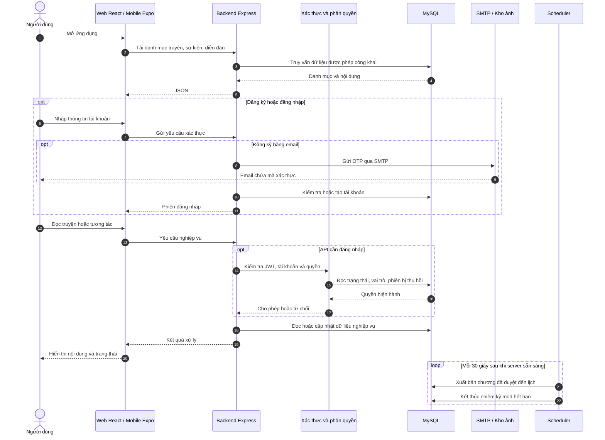
```mermaid
sequenceDiagram
    autonumber
    actor User as Người dùng
    participant Client as Web React / Mobile Expo
    participant API as Backend Express
    participant Auth as Xác thực và phân quyền
    participant DB as MySQL
    participant External as SMTP / Kho ảnh
    participant Job as Scheduler

    User->>Client: Mở ứng dụng
    Client->>API: Tải danh mục truyện, sự kiện, diễn đàn
    API->>DB: Truy vấn dữ liệu được phép công khai
    DB-->>API: Danh mục và nội dung
    API-->>Client: JSON
    opt Đăng ký hoặc đăng nhập
        User->>Client: Nhập thông tin tài khoản
        Client->>API: Gửi yêu cầu xác thực
        opt Đăng ký bằng email
            API->>External: Gửi OTP qua SMTP
            External-->>User: Email chứa mã xác thực
        end
        API->>DB: Kiểm tra hoặc tạo tài khoản
        API-->>Client: Phiên đăng nhập
    end
    User->>Client: Đọc truyện hoặc tương tác
    Client->>API: Yêu cầu nghiệp vụ
    opt API cần đăng nhập
        API->>Auth: Kiểm tra JWT, tài khoản và quyền
        Auth->>DB: Đọc trạng thái, vai trò, phiên bị thu hồi
        DB-->>Auth: Quyền hiện hành
        Auth-->>API: Cho phép hoặc từ chối
    end
    API->>DB: Đọc hoặc cập nhật dữ liệu nghiệp vụ
    API-->>Client: Kết quả xử lý
    Client-->>User: Hiển thị nội dung và trạng thái
    loop Mỗi 30 giây sau khi server sẵn sàng
        Job->>DB: Xuất bản chương đã duyệt đến lịch
        Job->>DB: Kết thúc nhiệm kỳ mod hết hạn
    end
```

## 02. Khởi động server, kiểm tra sức khỏe và dừng ứng dụng

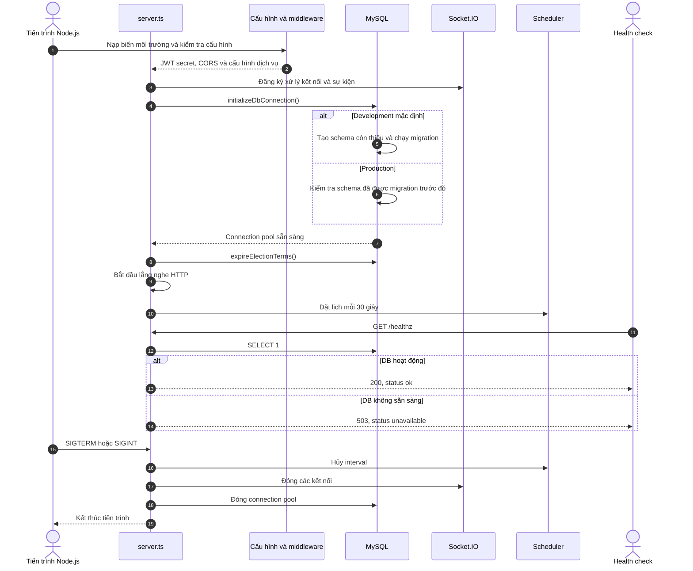
```mermaid
sequenceDiagram
    autonumber
    actor Runtime as Tiến trình Node.js
    participant Server as server.ts
    participant Config as Cấu hình và middleware
    participant DB as MySQL
    participant IO as Socket.IO
    participant Job as Scheduler
    actor Monitor as Health check

    Runtime->>Config: Nạp biến môi trường và kiểm tra cấu hình
    Config-->>Server: JWT secret, CORS và cấu hình dịch vụ
    Server->>IO: Đăng ký xử lý kết nối và sự kiện
    Server->>DB: initializeDbConnection()
    alt Development mặc định
        DB->>DB: Tạo schema còn thiếu và chạy migration
    else Production
        DB->>DB: Kiểm tra schema đã được migration trước đó
    end
    DB-->>Server: Connection pool sẵn sàng
    Server->>DB: expireElectionTerms()
    Server->>Server: Bắt đầu lắng nghe HTTP
    Server->>Job: Đặt lịch mỗi 30 giây
    Monitor->>Server: GET /healthz
    Server->>DB: SELECT 1
    alt DB hoạt động
        Server-->>Monitor: 200, status ok
    else DB không sẵn sàng
        Server-->>Monitor: 503, status unavailable
    end
    Runtime->>Server: SIGTERM hoặc SIGINT
    Server->>Job: Hủy interval
    Server->>IO: Đóng các kết nối
    Server->>DB: Đóng connection pool
    Server-->>Runtime: Kết thúc tiến trình
```

## 03. Xử lý chung một request cần xác thực

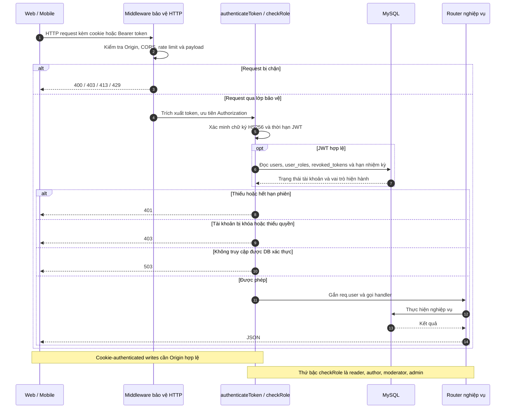
```mermaid
sequenceDiagram
    autonumber
    participant Client as Web / Mobile
    participant Security as Middleware bảo vệ HTTP
    participant Auth as authenticateToken / checkRole
    participant DB as MySQL
    participant Route as Router nghiệp vụ

    Client->>Security: HTTP request kèm cookie hoặc Bearer token
    Security->>Security: Kiểm tra Origin, CORS, rate limit và payload
    alt Request bị chặn
        Security-->>Client: 400 / 403 / 413 / 429
    else Request qua lớp bảo vệ
        Security->>Auth: Trích xuất token, ưu tiên Authorization
        Auth->>Auth: Xác minh chữ ký HS256 và thời hạn JWT
        opt JWT hợp lệ
            Auth->>DB: Đọc users, user_roles, revoked_tokens và hạn nhiệm kỳ
            DB-->>Auth: Trạng thái tài khoản và vai trò hiện hành
        end
        alt Thiếu hoặc hết hạn phiên
            Auth-->>Client: 401
        else Tài khoản bị khóa hoặc thiếu quyền
            Auth-->>Client: 403
        else Không truy cập được DB xác thực
            Auth-->>Client: 503
        else Được phép
            Auth->>Route: Gắn req.user và gọi handler
            Route->>DB: Thực hiện nghiệp vụ
            DB-->>Route: Kết quả
            Route-->>Client: JSON
        end
    end
    Note over Client,Auth: Cookie-authenticated writes cần Origin hợp lệ
    Note over Auth,Route: Thứ bậc checkRole là reader, author, moderator, admin
```

Route công khai có `optionalAuthentication` vẫn xác thực khi client gửi cookie/token. Các thao tác sửa tài nguyên còn kiểm tra chủ sở hữu trong handler.

## 04. Gửi OTP và đăng ký tài khoản

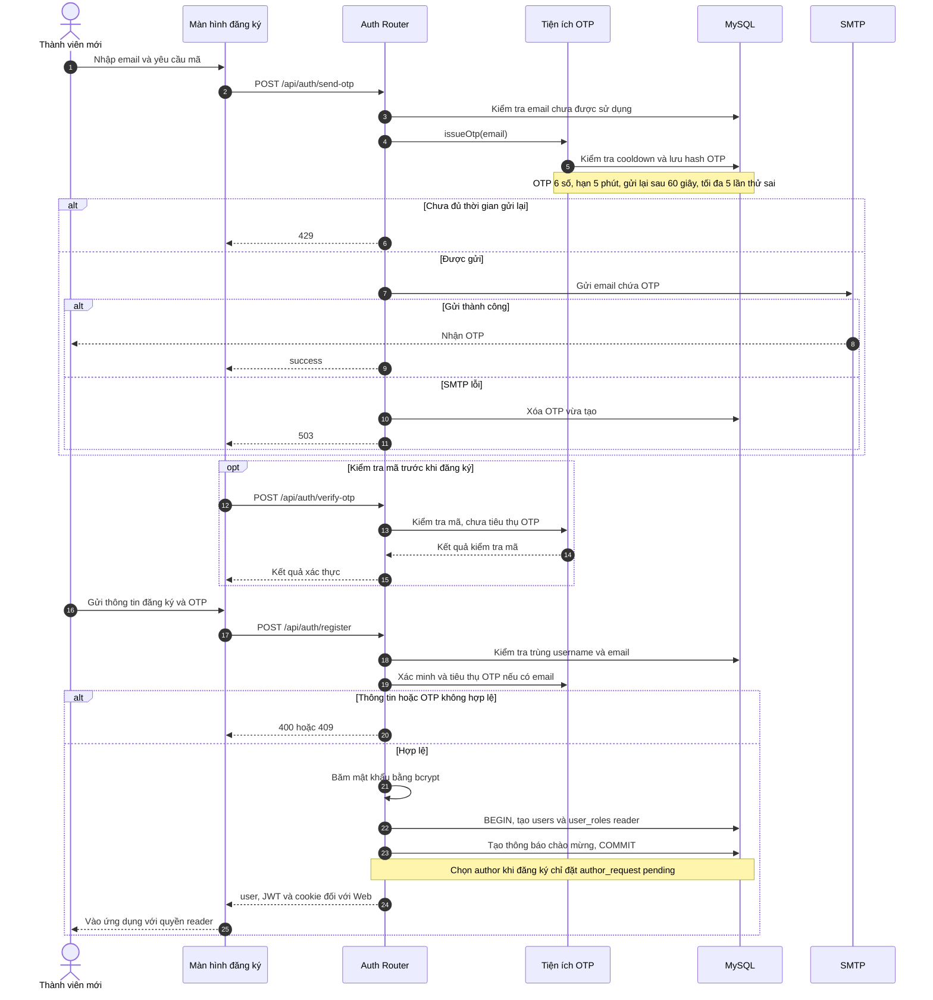
```mermaid
sequenceDiagram
    autonumber
    actor User as Thành viên mới
    participant Client as Màn hình đăng ký
    participant API as Auth Router
    participant OTP as Tiện ích OTP
    participant DB as MySQL
    participant Mail as SMTP

    User->>Client: Nhập email và yêu cầu mã
    Client->>API: POST /api/auth/send-otp
    API->>DB: Kiểm tra email chưa được sử dụng
    API->>OTP: issueOtp(email)
    OTP->>DB: Kiểm tra cooldown và lưu hash OTP
    Note over OTP,DB: OTP 6 số, hạn 5 phút, gửi lại sau 60 giây, tối đa 5 lần thử sai
    alt Chưa đủ thời gian gửi lại
        API-->>Client: 429
    else Được gửi
        API->>Mail: Gửi email chứa OTP
        alt Gửi thành công
            Mail-->>User: Nhận OTP
            API-->>Client: success
        else SMTP lỗi
            API->>DB: Xóa OTP vừa tạo
            API-->>Client: 503
        end
    end
    opt Kiểm tra mã trước khi đăng ký
        Client->>API: POST /api/auth/verify-otp
        API->>OTP: Kiểm tra mã, chưa tiêu thụ OTP
        OTP-->>API: Kết quả kiểm tra mã
        API-->>Client: Kết quả xác thực
    end
    User->>Client: Gửi thông tin đăng ký và OTP
    Client->>API: POST /api/auth/register
    API->>DB: Kiểm tra trùng username và email
    API->>OTP: Xác minh và tiêu thụ OTP nếu có email
    alt Thông tin hoặc OTP không hợp lệ
        API-->>Client: 400 hoặc 409
    else Hợp lệ
        API->>API: Băm mật khẩu bằng bcrypt
        API->>DB: BEGIN, tạo users và user_roles reader
        API->>DB: Tạo thông báo chào mừng, COMMIT
        Note over API,DB: Chọn author khi đăng ký chỉ đặt author_request pending
        API-->>Client: user, JWT và cookie đối với Web
        Client-->>User: Vào ứng dụng với quyền reader
    end
```

Production yêu cầu email. OTP phục vụ đăng ký; source hiện tại chưa có luồng quên mật khẩu. Chế độ development có thể cho đăng ký không có email.

## 05. Đăng nhập, tải lại phiên và đăng xuất

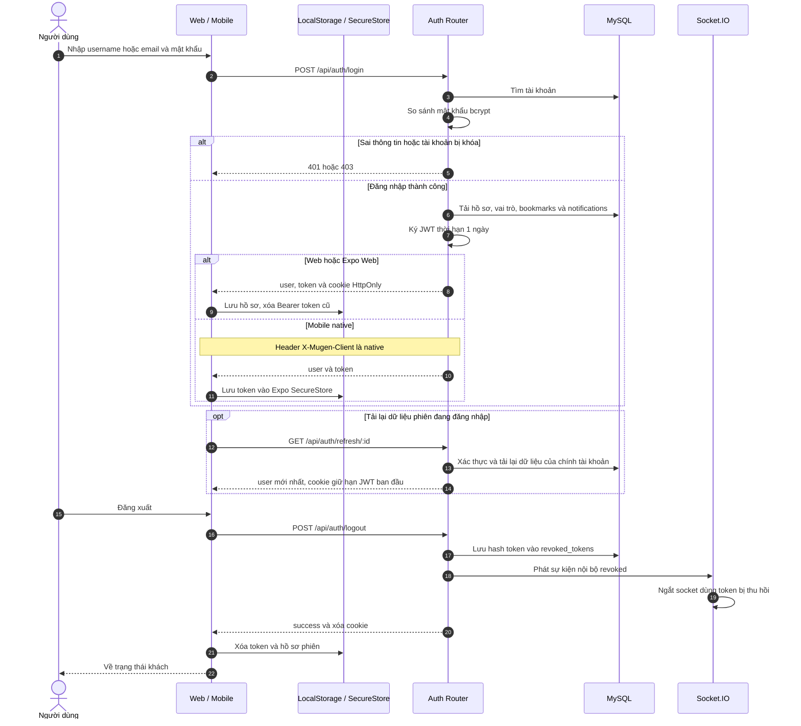
```mermaid
sequenceDiagram
    autonumber
    actor User as Người dùng
    participant Client as Web / Mobile
    participant Local as LocalStorage / SecureStore
    participant API as Auth Router
    participant DB as MySQL
    participant IO as Socket.IO

    User->>Client: Nhập username hoặc email và mật khẩu
    Client->>API: POST /api/auth/login
    API->>DB: Tìm tài khoản
    API->>API: So sánh mật khẩu bcrypt
    alt Sai thông tin hoặc tài khoản bị khóa
        API-->>Client: 401 hoặc 403
    else Đăng nhập thành công
        API->>DB: Tải hồ sơ, vai trò, bookmarks và notifications
        API->>API: Ký JWT thời hạn 1 ngày
        alt Web hoặc Expo Web
            API-->>Client: user, token và cookie HttpOnly
            Client->>Local: Lưu hồ sơ, xóa Bearer token cũ
        else Mobile native
            Note over Client,API: Header X-Mugen-Client là native
            API-->>Client: user và token
            Client->>Local: Lưu token vào Expo SecureStore
        end
    end
    opt Tải lại dữ liệu phiên đang đăng nhập
        Client->>API: GET /api/auth/refresh/:id
        API->>DB: Xác thực và tải lại dữ liệu của chính tài khoản
        API-->>Client: user mới nhất, cookie giữ hạn JWT ban đầu
    end
    User->>Client: Đăng xuất
    Client->>API: POST /api/auth/logout
    API->>DB: Lưu hash token vào revoked_tokens
    API->>IO: Phát sự kiện nội bộ revoked
    IO->>IO: Ngắt socket dùng token bị thu hồi
    API-->>Client: success và xóa cookie
    Client->>Local: Xóa token và hồ sơ phiên
    Client-->>User: Về trạng thái khách
```

`refresh/:id` tải lại dữ liệu phiên, không phát JWT mới và không kéo dài hạn đăng nhập. API client xử lý phiên hết hiệu lực bằng cách xóa phiên cục bộ tương ứng.

## 06. Hồ sơ cá nhân và đăng ký quyền tác giả

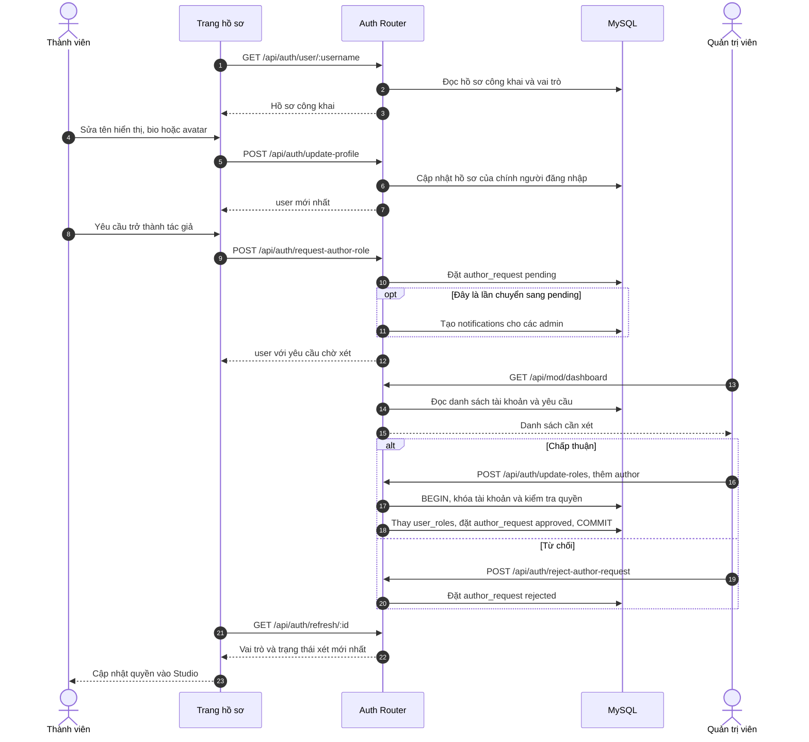
```mermaid
sequenceDiagram
    autonumber
    actor Member as Thành viên
    participant Client as Trang hồ sơ
    participant API as Auth Router
    participant DB as MySQL
    actor Admin as Quản trị viên

    Client->>API: GET /api/auth/user/:username
    API->>DB: Đọc hồ sơ công khai và vai trò
    API-->>Client: Hồ sơ công khai
    Member->>Client: Sửa tên hiển thị, bio hoặc avatar
    Client->>API: POST /api/auth/update-profile
    API->>DB: Cập nhật hồ sơ của chính người đăng nhập
    API-->>Client: user mới nhất
    Member->>Client: Yêu cầu trở thành tác giả
    Client->>API: POST /api/auth/request-author-role
    API->>DB: Đặt author_request pending
    opt Đây là lần chuyển sang pending
        API->>DB: Tạo notifications cho các admin
    end
    API-->>Client: user với yêu cầu chờ xét
    Admin->>API: GET /api/mod/dashboard
    API->>DB: Đọc danh sách tài khoản và yêu cầu
    API-->>Admin: Danh sách cần xét
    alt Chấp thuận
        Admin->>API: POST /api/auth/update-roles, thêm author
        API->>DB: BEGIN, khóa tài khoản và kiểm tra quyền
        API->>DB: Thay user_roles, đặt author_request approved, COMMIT
    else Từ chối
        Admin->>API: POST /api/auth/reject-author-request
        API->>DB: Đặt author_request rejected
    end
    Client->>API: GET /api/auth/refresh/:id
    API-->>Client: Vai trò và trạng thái xét mới nhất
    Client-->>Member: Cập nhật quyền vào Studio
```

## 07. Tải danh mục, tìm kiếm, lọc và xem chi tiết truyện

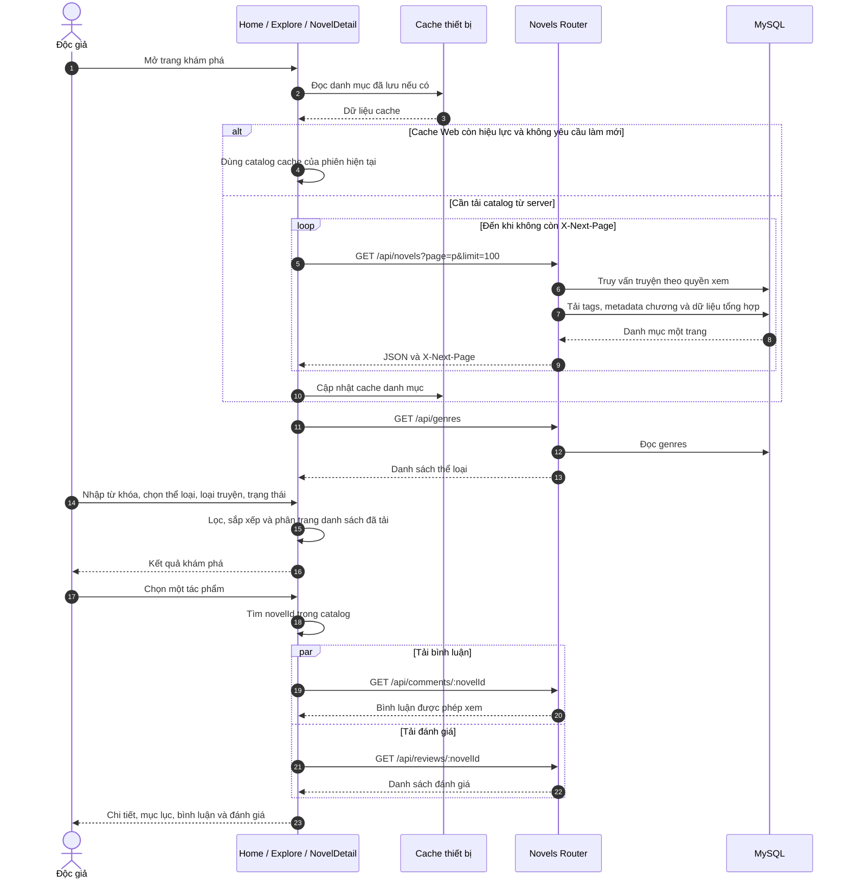
```mermaid
sequenceDiagram
    autonumber
    actor Reader as Độc giả
    participant Client as Home / Explore / NovelDetail
    participant Cache as Cache thiết bị
    participant API as Novels Router
    participant DB as MySQL

    Reader->>Client: Mở trang khám phá
    Client->>Cache: Đọc danh mục đã lưu nếu có
    Cache-->>Client: Dữ liệu cache
    alt Cache Web còn hiệu lực và không yêu cầu làm mới
        Client->>Client: Dùng catalog cache của phiên hiện tại
    else Cần tải catalog từ server
        loop Đến khi không còn X-Next-Page
            Client->>API: GET /api/novels?page=p&limit=100
            API->>DB: Truy vấn truyện theo quyền xem
            API->>DB: Tải tags, metadata chương và dữ liệu tổng hợp
            DB-->>API: Danh mục một trang
            API-->>Client: JSON và X-Next-Page
        end
        Client->>Cache: Cập nhật cache danh mục
    end
    Client->>API: GET /api/genres
    API->>DB: Đọc genres
    API-->>Client: Danh sách thể loại
    Reader->>Client: Nhập từ khóa, chọn thể loại, loại truyện, trạng thái
    Client->>Client: Lọc, sắp xếp và phân trang danh sách đã tải
    Client-->>Reader: Kết quả khám phá
    Reader->>Client: Chọn một tác phẩm
    Client->>Client: Tìm novelId trong catalog
    par Tải bình luận
        Client->>API: GET /api/comments/:novelId
        API-->>Client: Bình luận được phép xem
    and Tải đánh giá
        Client->>API: GET /api/reviews/:novelId
        API-->>Client: Danh sách đánh giá
    end
    Client-->>Reader: Chi tiết, mục lục, bình luận và đánh giá
```

Khách chỉ thấy truyện chưa bị khóa và có ít nhất một chương `published`; chủ truyện, mod và admin có phạm vi xem rộng hơn. Chi tiết lấy từ catalog; backend không có endpoint `GET /api/novels/:id`.

## 08. Mở chương và ghi nhận lượt đọc

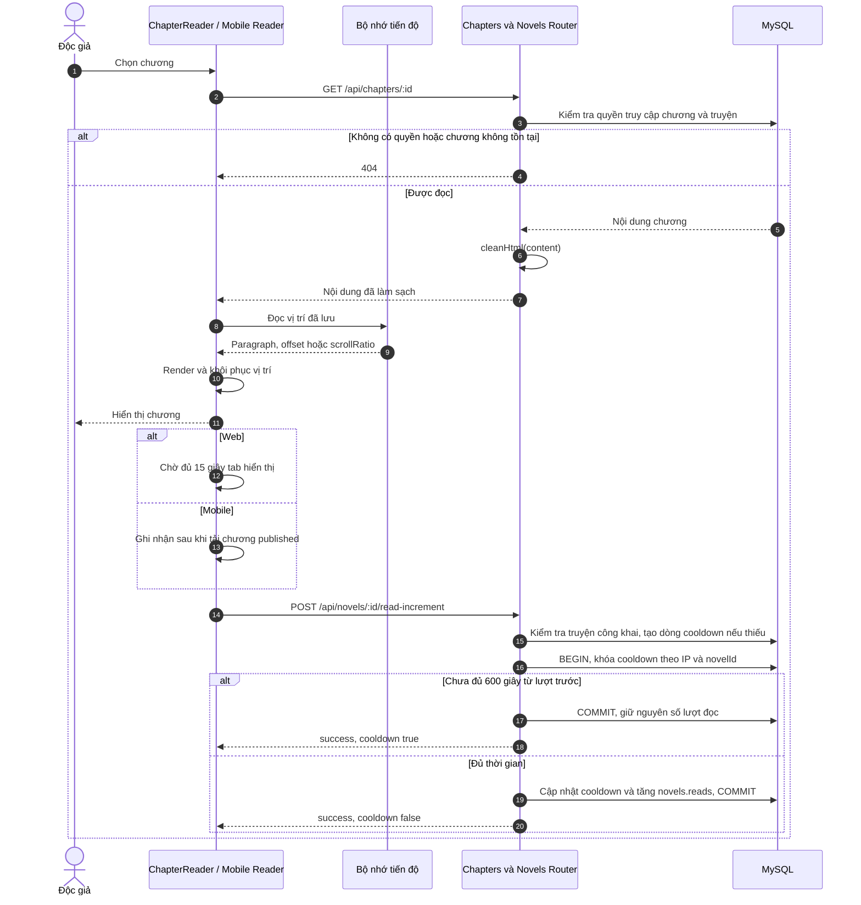
```mermaid
sequenceDiagram
    autonumber
    actor Reader as Độc giả
    participant Client as ChapterReader / Mobile Reader
    participant Local as Bộ nhớ tiến độ
    participant API as Chapters và Novels Router
    participant DB as MySQL

    Reader->>Client: Chọn chương
    Client->>API: GET /api/chapters/:id
    API->>DB: Kiểm tra quyền truy cập chương và truyện
    alt Không có quyền hoặc chương không tồn tại
        API-->>Client: 404
    else Được đọc
        DB-->>API: Nội dung chương
        API->>API: cleanHtml(content)
        API-->>Client: Nội dung đã làm sạch
        Client->>Local: Đọc vị trí đã lưu
        Local-->>Client: Paragraph, offset hoặc scrollRatio
        Client->>Client: Render và khôi phục vị trí
        Client-->>Reader: Hiển thị chương
        alt Web
            Client->>Client: Chờ đủ 15 giây tab hiển thị
        else Mobile
            Client->>Client: Ghi nhận sau khi tải chương published
        end
        Client->>API: POST /api/novels/:id/read-increment
        API->>DB: Kiểm tra truyện công khai, tạo dòng cooldown nếu thiếu
        API->>DB: BEGIN, khóa cooldown theo IP và novelId
        alt Chưa đủ 600 giây từ lượt trước
            API->>DB: COMMIT, giữ nguyên số lượt đọc
            API-->>Client: success, cooldown true
        else Đủ thời gian
            API->>DB: Cập nhật cooldown và tăng novels.reads, COMMIT
            API-->>Client: success, cooldown false
        end
    end
```

Web còn dùng DOMPurify trước khi render nội dung. Chống tăng lượt đọc dựa trên cặp IP–truyện, tách biệt với cơ chế hoàn thành chương và thưởng XP.

## 09. Lưu vị trí đọc và đồng bộ giữa thiết bị

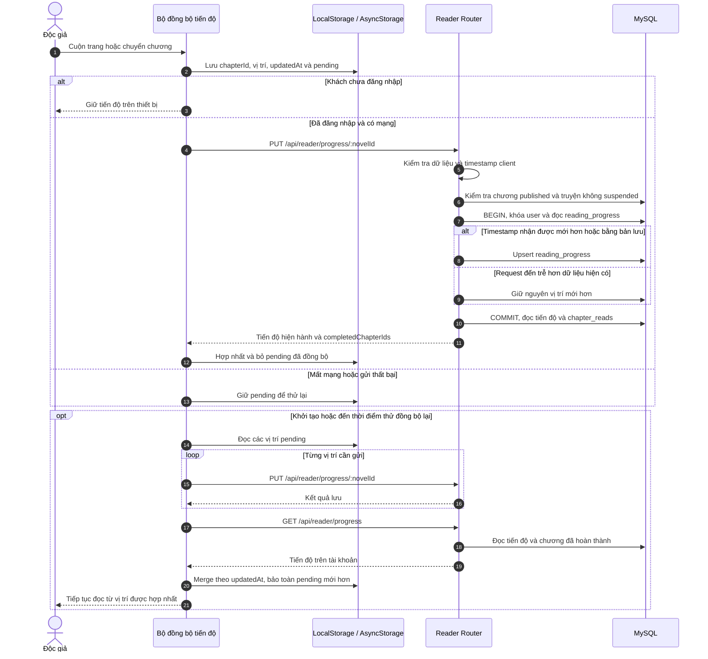
```mermaid
sequenceDiagram
    autonumber
    actor Reader as Độc giả
    participant Client as Bộ đồng bộ tiến độ
    participant Local as LocalStorage / AsyncStorage
    participant API as Reader Router
    participant DB as MySQL

    Reader->>Client: Cuộn trang hoặc chuyển chương
    Client->>Local: Lưu chapterId, vị trí, updatedAt và pending
    alt Khách chưa đăng nhập
        Client-->>Reader: Giữ tiến độ trên thiết bị
    else Đã đăng nhập và có mạng
        Client->>API: PUT /api/reader/progress/:novelId
        API->>API: Kiểm tra dữ liệu và timestamp client
        API->>DB: Kiểm tra chương published và truyện không suspended
        API->>DB: BEGIN, khóa user và đọc reading_progress
        alt Timestamp nhận được mới hơn hoặc bằng bản lưu
            API->>DB: Upsert reading_progress
        else Request đến trễ hơn dữ liệu hiện có
            API->>DB: Giữ nguyên vị trí mới hơn
        end
        API->>DB: COMMIT, đọc tiến độ và chapter_reads
        API-->>Client: Tiến độ hiện hành và completedChapterIds
        Client->>Local: Hợp nhất và bỏ pending đã đồng bộ
    else Mất mạng hoặc gửi thất bại
        Client->>Local: Giữ pending để thử lại
    end
    opt Khởi tạo hoặc đến thời điểm thử đồng bộ lại
        Client->>Local: Đọc các vị trí pending
        loop Từng vị trí cần gửi
            Client->>API: PUT /api/reader/progress/:novelId
            API-->>Client: Kết quả lưu
        end
        Client->>API: GET /api/reader/progress
        API->>DB: Đọc tiến độ và chương đã hoàn thành
        API-->>Client: Tiến độ trên tài khoản
        Client->>Local: Merge theo updatedAt, bảo toàn pending mới hơn
        Client-->>Reader: Tiếp tục đọc từ vị trí được hợp nhất
    end
```

Web thử đồng bộ lại khi có mạng hoặc tab hiện lại; Mobile thử lại khi mở reader, tủ sách hoặc lưu mới. Tiến độ khách và tài khoản có khóa lưu riêng. Hàng đợi offline này lưu **tiến độ**, không tải sẵn toàn bộ nội dung truyện để đọc offline.

## 10. Hoàn thành chương, thưởng XP và lên cấp

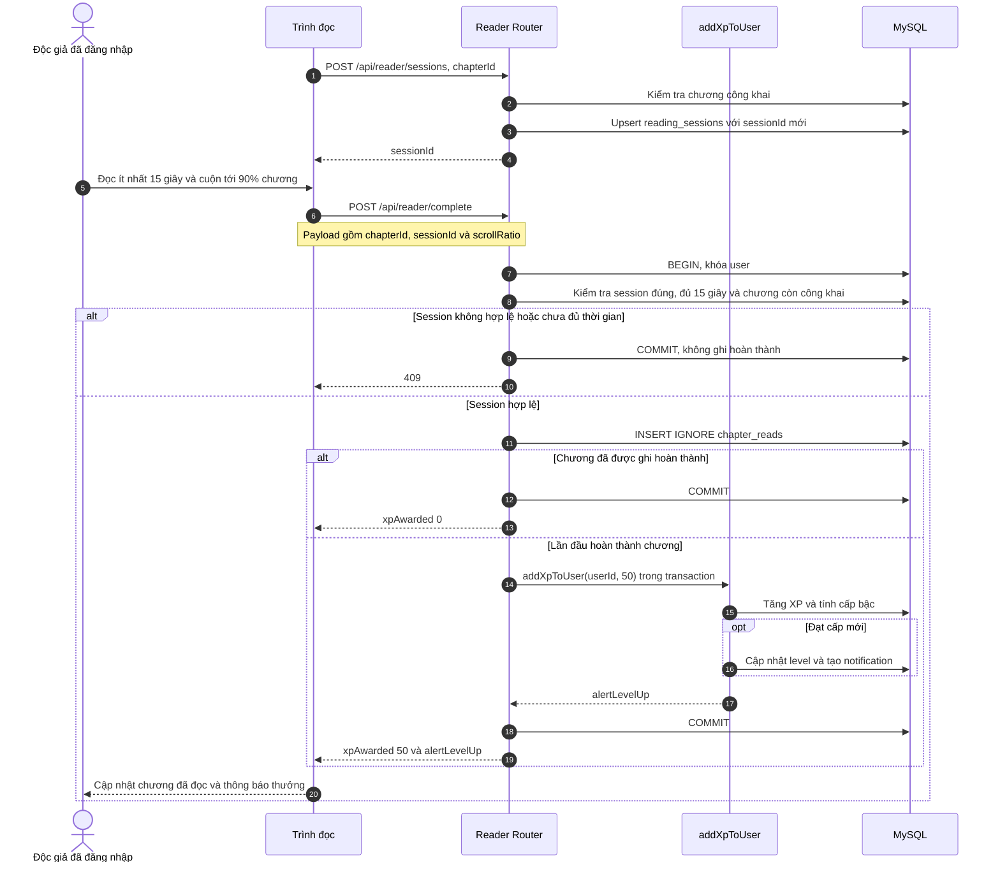
```mermaid
sequenceDiagram
    autonumber
    actor Reader as Độc giả đã đăng nhập
    participant Client as Trình đọc
    participant API as Reader Router
    participant Level as addXpToUser
    participant DB as MySQL

    Client->>API: POST /api/reader/sessions, chapterId
    API->>DB: Kiểm tra chương công khai
    API->>DB: Upsert reading_sessions với sessionId mới
    API-->>Client: sessionId
    Reader->>Client: Đọc ít nhất 15 giây và cuộn tới 90% chương
    Client->>API: POST /api/reader/complete
    Note over Client,API: Payload gồm chapterId, sessionId và scrollRatio
    API->>DB: BEGIN, khóa user
    API->>DB: Kiểm tra session đúng, đủ 15 giây và chương còn công khai
    alt Session không hợp lệ hoặc chưa đủ thời gian
        API->>DB: COMMIT, không ghi hoàn thành
        API-->>Client: 409
    else Session hợp lệ
        API->>DB: INSERT IGNORE chapter_reads
        alt Chương đã được ghi hoàn thành
            API->>DB: COMMIT
            API-->>Client: xpAwarded 0
        else Lần đầu hoàn thành chương
            API->>Level: addXpToUser(userId, 50) trong transaction
            Level->>DB: Tăng XP và tính cấp bậc
            opt Đạt cấp mới
                Level->>DB: Cập nhật level và tạo notification
            end
            Level-->>API: alertLevelUp
            API->>DB: COMMIT
            API-->>Client: xpAwarded 50 và alertLevelUp
        end
        Client-->>Reader: Cập nhật chương đã đọc và thông báo thưởng
    end
```

Web có thể đánh dấu hoàn thành cho khách ở local, nhưng không có thưởng XP trên server. Endpoint cộng XP trực tiếp đã ngừng hoạt động; hoàn thành chương là nghiệp vụ riêng có kiểm tra session.

## 11. Thiết lập giao diện đọc

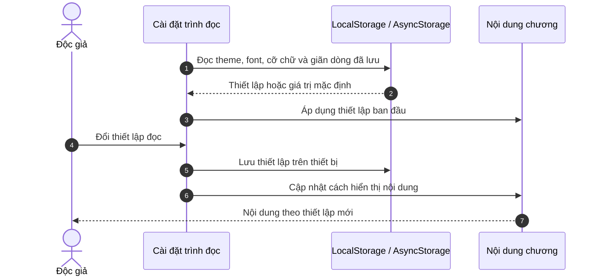
```mermaid
sequenceDiagram
    autonumber
    actor Reader as Độc giả
    participant Client as Cài đặt trình đọc
    participant Local as LocalStorage / AsyncStorage
    participant View as Nội dung chương

    Client->>Local: Đọc theme, font, cỡ chữ và giãn dòng đã lưu
    Local-->>Client: Thiết lập hoặc giá trị mặc định
    Client->>View: Áp dụng thiết lập ban đầu
    Reader->>Client: Đổi thiết lập đọc
    Client->>Local: Lưu thiết lập trên thiết bị
    Client->>View: Cập nhật cách hiển thị nội dung
    View-->>Reader: Nội dung theo thiết lập mới
```

Thiết lập đọc lưu cục bộ, chưa có API đồng bộ thiết lập hoặc chức năng đánh dấu văn bản/ghi chú trong reader hiện tại.

## 12. Bookmark, tủ sách và quản lý bộ sưu tập

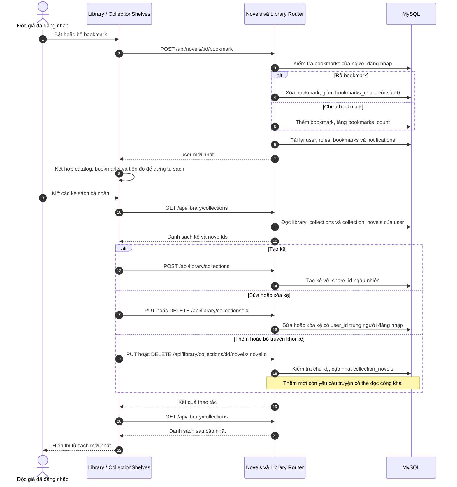
```mermaid
sequenceDiagram
    autonumber
    actor Reader as Độc giả đã đăng nhập
    participant Client as Library / CollectionShelves
    participant API as Novels và Library Router
    participant DB as MySQL

    Reader->>Client: Bật hoặc bỏ bookmark
    Client->>API: POST /api/novels/:id/bookmark
    API->>DB: Kiểm tra bookmarks của người đăng nhập
    alt Đã bookmark
        API->>DB: Xóa bookmark, giảm bookmarks_count với sàn 0
    else Chưa bookmark
        API->>DB: Thêm bookmark, tăng bookmarks_count
    end
    API->>DB: Tải lại user, roles, bookmarks và notifications
    API-->>Client: user mới nhất
    Client->>Client: Kết hợp catalog, bookmarks và tiến độ để dựng tủ sách
    Reader->>Client: Mở các kệ sách cá nhân
    Client->>API: GET /api/library/collections
    API->>DB: Đọc library_collections và collection_novels của user
    API-->>Client: Danh sách kệ và novelIds
    alt Tạo kệ
        Client->>API: POST /api/library/collections
        API->>DB: Tạo kệ với share_id ngẫu nhiên
    else Sửa hoặc xóa kệ
        Client->>API: PUT hoặc DELETE /api/library/collections/:id
        API->>DB: Sửa hoặc xóa kệ có user_id trùng người đăng nhập
    else Thêm hoặc bỏ truyện khỏi kệ
        Client->>API: PUT hoặc DELETE /api/library/collections/:id/novels/:novelId
        API->>DB: Kiểm tra chủ kệ, cập nhật collection_novels
        Note over API,DB: Thêm mới còn yêu cầu truyện có thể đọc công khai
    end
    API-->>Client: Kết quả thao tác
    Client->>API: GET /api/library/collections
    API-->>Client: Danh sách sau cập nhật
    Client-->>Reader: Hiển thị tủ sách mới nhất
```

Bookmark và thành viên bộ sưu tập là dữ liệu riêng. Xóa một kệ không xóa tác phẩm hoặc bookmark. Mọi thao tác sửa kệ đều kiểm tra chủ sở hữu.

## 13. Chia sẻ và xem bộ sưu tập công khai

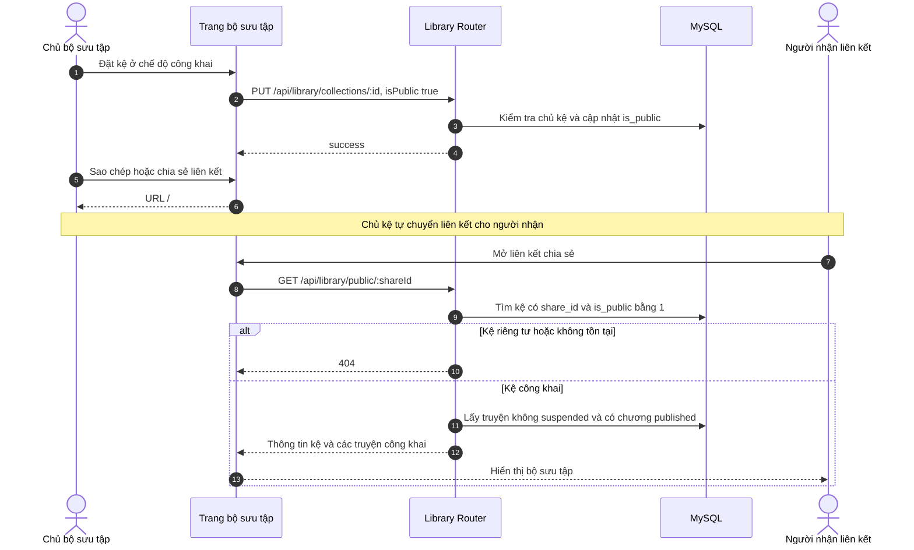
```mermaid
sequenceDiagram
    autonumber
    actor Owner as Chủ bộ sưu tập
    participant Client as Trang bộ sưu tập
    participant API as Library Router
    participant DB as MySQL
    actor Guest as Người nhận liên kết

    Owner->>Client: Đặt kệ ở chế độ công khai
    Client->>API: PUT /api/library/collections/:id, isPublic true
    API->>DB: Kiểm tra chủ kệ và cập nhật is_public
    API-->>Client: success
    Owner->>Client: Sao chép hoặc chia sẻ liên kết
    Client-->>Owner: URL /#/collection/shareId
    Note over Owner,Guest: Chủ kệ tự chuyển liên kết cho người nhận
    Guest->>Client: Mở liên kết chia sẻ
    Client->>API: GET /api/library/public/:shareId
    API->>DB: Tìm kệ có share_id và is_public bằng 1
    alt Kệ riêng tư hoặc không tồn tại
        API-->>Client: 404
    else Kệ công khai
        API->>DB: Lấy truyện không suspended và có chương published
        API-->>Client: Thông tin kệ và các truyện công khai
        Client-->>Guest: Hiển thị bộ sưu tập
    end
```

## 14. Upload ảnh bìa và ảnh nội dung

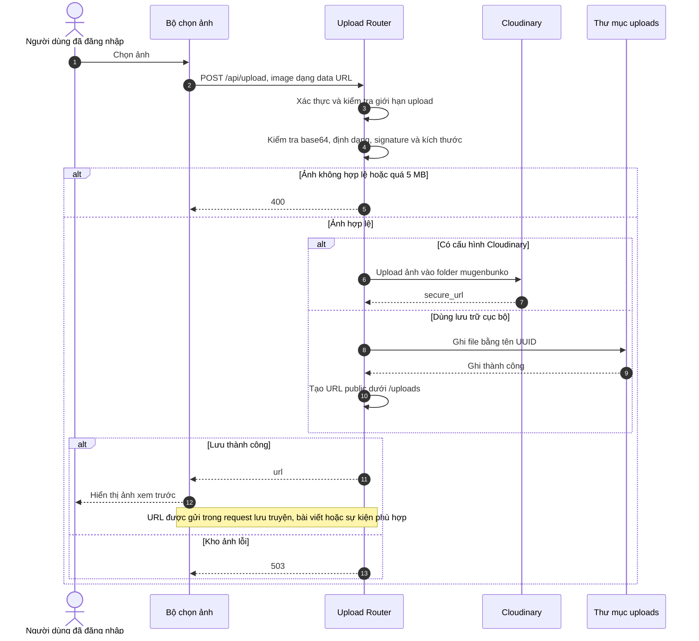
```mermaid
sequenceDiagram
    autonumber
    actor User as Người dùng đã đăng nhập
    participant Client as Bộ chọn ảnh
    participant API as Upload Router
    participant Cloud as Cloudinary
    participant Disk as Thư mục uploads

    User->>Client: Chọn ảnh
    Client->>API: POST /api/upload, image dạng data URL
    API->>API: Xác thực và kiểm tra giới hạn upload
    API->>API: Kiểm tra base64, định dạng, signature và kích thước
    alt Ảnh không hợp lệ hoặc quá 5 MB
        API-->>Client: 400
    else Ảnh hợp lệ
        alt Có cấu hình Cloudinary
            API->>Cloud: Upload ảnh vào folder mugenbunko
            Cloud-->>API: secure_url
        else Dùng lưu trữ cục bộ
            API->>Disk: Ghi file bằng tên UUID
            Disk-->>API: Ghi thành công
            API->>API: Tạo URL public dưới /uploads
        end
        alt Lưu thành công
            API-->>Client: url
            Client-->>User: Hiển thị ảnh xem trước
            Note over Client,API: URL được gửi trong request lưu truyện, bài viết hoặc sự kiện phù hợp
        else Kho ảnh lỗi
            API-->>Client: 503
        end
    end
```

## 15. Tạo, chỉnh sửa và xóa tác phẩm trong Studio

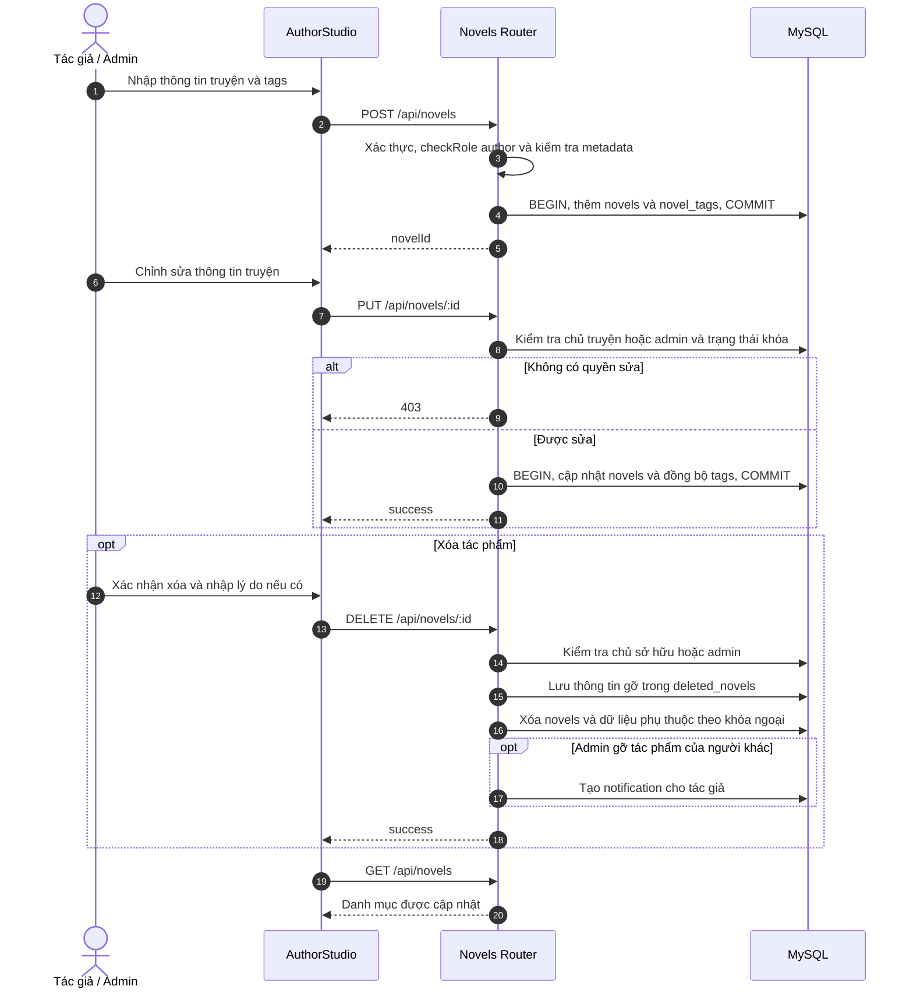
```mermaid
sequenceDiagram
    autonumber
    actor Author as Tác giả / Admin
    participant Client as AuthorStudio
    participant API as Novels Router
    participant DB as MySQL

    Author->>Client: Nhập thông tin truyện và tags
    Client->>API: POST /api/novels
    API->>API: Xác thực, checkRole author và kiểm tra metadata
    API->>DB: BEGIN, thêm novels và novel_tags, COMMIT
    API-->>Client: novelId
    Author->>Client: Chỉnh sửa thông tin truyện
    Client->>API: PUT /api/novels/:id
    API->>DB: Kiểm tra chủ truyện hoặc admin và trạng thái khóa
    alt Không có quyền sửa
        API-->>Client: 403
    else Được sửa
        API->>DB: BEGIN, cập nhật novels và đồng bộ tags, COMMIT
        API-->>Client: success
    end
    opt Xóa tác phẩm
        Author->>Client: Xác nhận xóa và nhập lý do nếu có
        Client->>API: DELETE /api/novels/:id
        API->>DB: Kiểm tra chủ sở hữu hoặc admin
        API->>DB: Lưu thông tin gỡ trong deleted_novels
        API->>DB: Xóa novels và dữ liệu phụ thuộc theo khóa ngoại
        opt Admin gỡ tác phẩm của người khác
            API->>DB: Tạo notification cho tác giả
        end
        API-->>Client: success
    end
    Client->>API: GET /api/novels
    API-->>Client: Danh mục được cập nhật
```

Khi truyện không còn trong catalog, client có thể gọi `GET /api/novels/deleted/:id`; staff được thấy tên/lý do đã lưu, khách nhận thông tin chung. Tác giả không có quyền tự gỡ trạng thái `suspended`.

## 16. Soạn chương, tự lưu, gửi duyệt và xóa chương/quyển

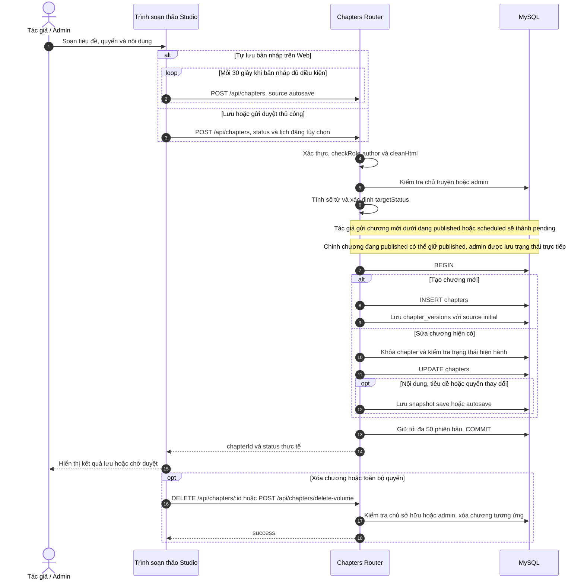
```mermaid
sequenceDiagram
    autonumber
    actor Author as Tác giả / Admin
    participant Editor as Trình soạn thảo Studio
    participant API as Chapters Router
    participant DB as MySQL

    Author->>Editor: Soạn tiêu đề, quyển và nội dung
    alt Tự lưu bản nháp trên Web
        loop Mỗi 30 giây khi bản nháp đủ điều kiện
            Editor->>API: POST /api/chapters, source autosave
        end
    else Lưu hoặc gửi duyệt thủ công
        Editor->>API: POST /api/chapters, status và lịch đăng tùy chọn
    end
    API->>API: Xác thực, checkRole author và cleanHtml
    API->>DB: Kiểm tra chủ truyện hoặc admin
    API->>API: Tính số từ và xác định targetStatus
    Note over API,DB: Tác giả gửi chương mới dưới dạng published hoặc scheduled sẽ thành pending
    Note over API,DB: Chỉnh chương đang published có thể giữ published, admin được lưu trạng thái trực tiếp
    API->>DB: BEGIN
    alt Tạo chương mới
        API->>DB: INSERT chapters
        API->>DB: Lưu chapter_versions với source initial
    else Sửa chương hiện có
        API->>DB: Khóa chapter và kiểm tra trạng thái hiện hành
        API->>DB: UPDATE chapters
        opt Nội dung, tiêu đề hoặc quyển thay đổi
            API->>DB: Lưu snapshot save hoặc autosave
        end
    end
    API->>DB: Giữ tối đa 50 phiên bản, COMMIT
    API-->>Editor: chapterId và status thực tế
    Editor-->>Author: Hiển thị kết quả lưu hoặc chờ duyệt
    opt Xóa chương hoặc toàn bộ quyển
        Editor->>API: DELETE /api/chapters/:id hoặc POST /api/chapters/delete-volume
        API->>DB: Kiểm tra chủ sở hữu hoặc admin, xóa chương tương ứng
        API-->>Editor: success
    end
```

## 17. Xem lịch sử và khôi phục phiên bản chương

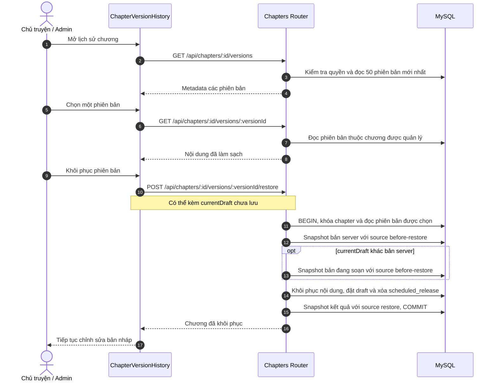
```mermaid
sequenceDiagram
    autonumber
    actor Author as Chủ truyện / Admin
    participant Editor as ChapterVersionHistory
    participant API as Chapters Router
    participant DB as MySQL

    Author->>Editor: Mở lịch sử chương
    Editor->>API: GET /api/chapters/:id/versions
    API->>DB: Kiểm tra quyền và đọc 50 phiên bản mới nhất
    API-->>Editor: Metadata các phiên bản
    Author->>Editor: Chọn một phiên bản
    Editor->>API: GET /api/chapters/:id/versions/:versionId
    API->>DB: Đọc phiên bản thuộc chương được quản lý
    API-->>Editor: Nội dung đã làm sạch
    Author->>Editor: Khôi phục phiên bản
    Editor->>API: POST /api/chapters/:id/versions/:versionId/restore
    Note over Editor,API: Có thể kèm currentDraft chưa lưu
    API->>DB: BEGIN, khóa chapter và đọc phiên bản được chọn
    API->>DB: Snapshot bản server với source before-restore
    opt currentDraft khác bản server
        API->>DB: Snapshot bản đang soạn với source before-restore
    end
    API->>DB: Khôi phục nội dung, đặt draft và xóa scheduled_release
    API->>DB: Snapshot kết quả với source restore, COMMIT
    API-->>Editor: Chương đã khôi phục
    Editor-->>Author: Tiếp tục chỉnh sửa bản nháp
```

## 18. Kiểm duyệt chương và phát hành theo lịch

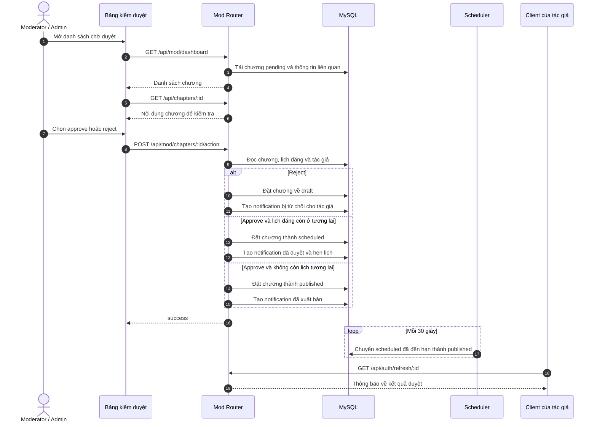
```mermaid
sequenceDiagram
    autonumber
    actor Mod as Moderator / Admin
    participant Dashboard as Bảng kiểm duyệt
    participant API as Mod Router
    participant DB as MySQL
    participant Job as Scheduler
    participant Author as Client của tác giả

    Mod->>Dashboard: Mở danh sách chờ duyệt
    Dashboard->>API: GET /api/mod/dashboard
    API->>DB: Tải chương pending và thông tin liên quan
    API-->>Dashboard: Danh sách chương
    Dashboard->>API: GET /api/chapters/:id
    API-->>Dashboard: Nội dung chương để kiểm tra
    Mod->>Dashboard: Chọn approve hoặc reject
    Dashboard->>API: POST /api/mod/chapters/:id/action
    API->>DB: Đọc chương, lịch đăng và tác giả
    alt Reject
        API->>DB: Đặt chương về draft
        API->>DB: Tạo notification bị từ chối cho tác giả
    else Approve và lịch đăng còn ở tương lai
        API->>DB: Đặt chương thành scheduled
        API->>DB: Tạo notification đã duyệt và hẹn lịch
    else Approve và không còn lịch tương lai
        API->>DB: Đặt chương thành published
        API->>DB: Tạo notification đã xuất bản
    end
    API-->>Dashboard: success
    loop Mỗi 30 giây
        Job->>DB: Chuyển scheduled đã đến hạn thành published
    end
    Author->>API: GET /api/auth/refresh/:id
    API-->>Author: Thông báo về kết quả duyệt
```

Scheduler chỉ cập nhật trạng thái, chưa tạo thông báo mới cho người bookmark/follow khi đến lịch. Nhánh tương thích cũ trong router duyệt còn có thể cấp `author` cho chủ truyện chưa có quyền; luồng tạo nội dung thông thường đã yêu cầu quyền tác giả trước đó.

## 19. Bình luận, trả lời và đánh giá tác phẩm

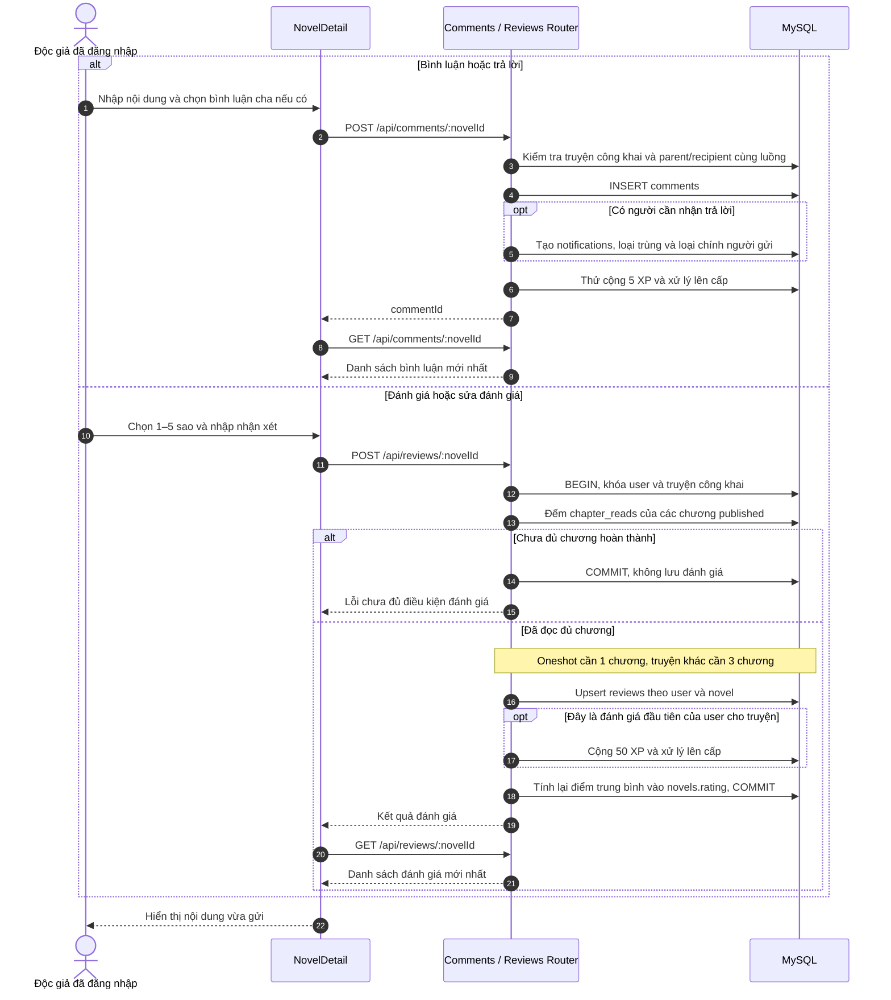
```mermaid
sequenceDiagram
    autonumber
    actor Reader as Độc giả đã đăng nhập
    participant Client as NovelDetail
    participant API as Comments / Reviews Router
    participant DB as MySQL

    alt Bình luận hoặc trả lời
        Reader->>Client: Nhập nội dung và chọn bình luận cha nếu có
        Client->>API: POST /api/comments/:novelId
        API->>DB: Kiểm tra truyện công khai và parent/recipient cùng luồng
        API->>DB: INSERT comments
        opt Có người cần nhận trả lời
            API->>DB: Tạo notifications, loại trùng và loại chính người gửi
        end
        API->>DB: Thử cộng 5 XP và xử lý lên cấp
        API-->>Client: commentId
        Client->>API: GET /api/comments/:novelId
        API-->>Client: Danh sách bình luận mới nhất
    else Đánh giá hoặc sửa đánh giá
        Reader->>Client: Chọn 1–5 sao và nhập nhận xét
        Client->>API: POST /api/reviews/:novelId
        API->>DB: BEGIN, khóa user và truyện công khai
        API->>DB: Đếm chapter_reads của các chương published
        alt Chưa đủ chương hoàn thành
            API->>DB: COMMIT, không lưu đánh giá
            API-->>Client: Lỗi chưa đủ điều kiện đánh giá
        else Đã đọc đủ chương
            Note over API,DB: Oneshot cần 1 chương, truyện khác cần 3 chương
            API->>DB: Upsert reviews theo user và novel
            opt Đây là đánh giá đầu tiên của user cho truyện
                API->>DB: Cộng 50 XP và xử lý lên cấp
            end
            API->>DB: Tính lại điểm trung bình vào novels.rating, COMMIT
            API-->>Client: Kết quả đánh giá
            Client->>API: GET /api/reviews/:novelId
            API-->>Client: Danh sách đánh giá mới nhất
        end
    end
    Client-->>Reader: Hiển thị nội dung vừa gửi
```

Thông báo/XP của bình luận được xử lý theo khả năng sau khi lưu; lỗi bước phụ không hoàn tác bình luận. Sửa đánh giá cũ không nhận thêm XP.

## 20. Báo cáo và xử lý bình luận vi phạm

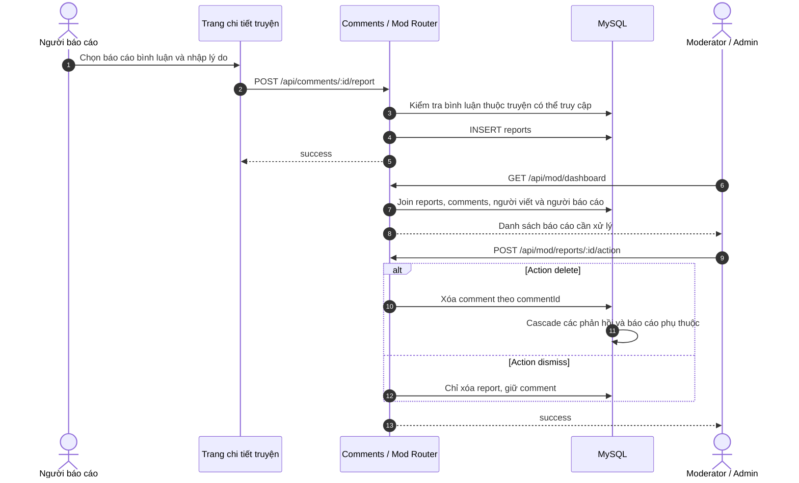
```mermaid
sequenceDiagram
    autonumber
    actor Reader as Người báo cáo
    participant Client as Trang chi tiết truyện
    participant API as Comments / Mod Router
    participant DB as MySQL
    actor Mod as Moderator / Admin

    Reader->>Client: Chọn báo cáo bình luận và nhập lý do
    Client->>API: POST /api/comments/:id/report
    API->>DB: Kiểm tra bình luận thuộc truyện có thể truy cập
    API->>DB: INSERT reports
    API-->>Client: success
    Mod->>API: GET /api/mod/dashboard
    API->>DB: Join reports, comments, người viết và người báo cáo
    API-->>Mod: Danh sách báo cáo cần xử lý
    Mod->>API: POST /api/mod/reports/:id/action
    alt Action delete
        API->>DB: Xóa comment theo commentId
        DB->>DB: Cascade các phản hồi và báo cáo phụ thuộc
    else Action dismiss
        API->>DB: Chỉ xóa report, giữ comment
    end
    API-->>Mod: success
```

Luồng này dành cho bình luận truyện; source không có API báo cáo tổng quát cho mọi loại nội dung.

## 21. Diễn đàn: đăng bài, thích và thảo luận

```mermaid
sequenceDiagram
    autonumber
    actor Member as Thành viên
    participant Client as Forum / Community
    participant API as Forum Router
    participant DB as MySQL

    loop Tải từng trang danh sách
        Client->>API: GET /api/forum/posts?comments=none&page=p&limit=100
        API->>DB: Đọc forum_posts, tác giả, số like và số bình luận
        API-->>Client: Bài viết và X-Next-Page
    end
    Member->>Client: Tạo bài viết
    Client->>API: POST /api/forum/posts
    API->>API: Kiểm tra dữ liệu và quyền đăng danh mục thông báo
    API->>DB: INSERT forum_posts
    API->>DB: Thử cộng 15 XP cho người đăng
    API-->>Client: Kết quả tạo bài
    Member->>Client: Mở bài viết
    Client->>API: GET /api/forum/posts/:id
    API->>DB: Đọc bài và cây forum_comments
    API-->>Client: Chi tiết bài viết
    opt Thích hoặc bỏ thích
        Client->>API: POST /api/forum/posts/:id/like
        API->>DB: Toggle forum_post_likes
        API-->>Client: Số like mới
    end
    opt Bình luận hoặc trả lời
        Client->>API: POST /api/forum/posts/:id/comments
        API->>DB: Kiểm tra hạn chế bình luận, parent và recipient
        API->>DB: INSERT forum_comments
        API->>DB: Thử tạo notifications cho người nhận phù hợp
        API-->>Client: Bình luận vừa tạo
    end
    opt Chủ bài hoặc admin xóa bài
        Client->>API: DELETE /api/forum/posts/:id
        API->>DB: Kiểm tra quyền và xóa bài
        API-->>Client: success
    end
    opt Admin đổi hạn chế bình luận
        Client->>API: PUT /api/forum/posts/:id/restrict-comments
        API->>DB: Cập nhật restrict_comments
        API-->>Client: success
    end
```

Danh mục thông báo yêu cầu mod/admin. API xóa bài cho chủ bài hoặc admin; riêng vai trò moderator không tự cho phép xóa bài của người khác. Bài bị hạn chế bình luận chỉ nhận phản hồi từ mod/admin.

## 22. Kết bạn và theo dõi tác giả

```mermaid
sequenceDiagram
    autonumber
    actor A as Thành viên A
    participant Client as Social / Hồ sơ
    participant API as Social / Auth Router
    participant DB as MySQL
    actor B as Thành viên B

    A->>Client: Tìm thành viên
    Client->>API: GET /api/social/users/search?q=keyword
    API->>DB: Tìm users
    API-->>Client: Kết quả tìm kiếm
    A->>Client: Gửi lời mời kết bạn
    Client->>API: POST /api/social/friends/request, friendId
    API->>DB: Kiểm tra quan hệ friends hai chiều
    alt Đã có lời mời ngược chiều
        API->>DB: Chuyển quan hệ thành accepted và tạo notification
    else Chưa có quan hệ
        API->>DB: Tạo friends pending và notification cho B
    else Tự mời, đã kết bạn hoặc mời lặp
        API-->>Client: Lỗi theo trạng thái quan hệ
    end
    opt B nhận lời mời pending
        B->>API: GET /api/social/friends
        API-->>B: Bạn bè và các lời mời
        alt Chấp nhận
            B->>API: POST /api/social/friends/accept
            API->>DB: Chuyển accepted, thông báo cho A
        else Từ chối
            B->>API: POST /api/social/friends/decline
            API->>DB: Xóa quan hệ tương ứng
        end
    end
    opt Theo dõi hoặc bỏ theo dõi tác giả
        A->>API: POST /api/auth/follow-author, authorUsername
        API->>DB: BEGIN, toggle follows, COMMIT
        API-->>A: Trạng thái theo dõi
    end
    Note over Client,API: friends/decline còn dùng để hủy lời mời hoặc hủy kết bạn
```

## 23. Kết nối Socket.IO và trạng thái online

```mermaid
sequenceDiagram
    autonumber
    participant Client as Socket client
    participant IO as Socket.IO Server
    participant Auth as resolveUser
    participant DB as MySQL
    participant Friends as Socket của bạn bè

    Client->>IO: Handshake bằng auth.token hoặc cookie
    IO->>Auth: Xác minh phiên
    Auth->>DB: Kiểm tra user, vai trò và token bị thu hồi
    DB-->>Auth: Tài khoản hiện hành
    alt Phiên không hợp lệ
        IO-->>Client: Từ chối kết nối
    else Phiên hợp lệ
        IO->>IO: Join room user:id và ghi presence trong bộ nhớ
        opt Đây là socket đầu tiên của tài khoản
            IO->>DB: Đọc danh sách friends accepted
            IO-->>Friends: friend_status_change, online
        end
        Client->>IO: check_online_status(ids, ack)
        IO->>DB: Lọc các id thuộc bạn bè đã chấp nhận
        IO-->>Client: ack trạng thái bạn bè được phép xem
        loop Khi nhận sự kiện
            IO->>Auth: Kiểm tra lại phiên, tài khoản và giới hạn sự kiện
            Auth-->>IO: Cho phép hoặc ngắt kết nối
        end
        opt Hết hạn JWT, bị thu hồi hoặc client ngắt
            IO->>IO: Dọn socket khỏi presence
            opt Đây là socket cuối cùng của tài khoản
                IO-->>Friends: friend_status_change, offline
            end
        end
    end
```

Presence hiện lưu trong bộ nhớ của một tiến trình. Server không có sự kiện socket thông báo tổng quát cho bảng `notifications`.

## 24. Nhắn tin riêng qua Socket.IO hoặc HTTP

```mermaid
sequenceDiagram
    autonumber
    actor Sender as Người gửi
    participant Client as Chat client
    participant Transport as Socket.IO / Social Router
    participant Service as sendMessage
    participant DB as MySQL
    participant Receiver as Client người nhận

    Sender->>Client: Soạn tin nhắn
    alt Gửi bằng Socket.IO
        Client->>Transport: send_message với receiverId, messageText và ack
    else Gửi bằng HTTP
        Client->>Transport: POST /api/social/messages/send
        Note over Client,Transport: Body gồm receiverId và messageText
    end
    Transport->>Service: sendMessage(senderId, receiverId, messageText)
    Service->>Service: Kiểm tra nội dung tối đa 5000 ký tự
    Service->>DB: BEGIN, khóa hai users theo thứ tự id
    Service->>DB: Kiểm tra tài khoản active, friendship accepted và tần suất gửi
    alt Không đủ điều kiện
        Service->>DB: COMMIT, không lưu tin nhắn
        Service-->>Transport: Lỗi nghiệp vụ
        Transport-->>Client: ack lỗi hoặc HTTP lỗi
    else Đủ điều kiện
        Service->>DB: INSERT messages, COMMIT
        Service-->>Transport: message
        alt Đường gửi Socket.IO
            Transport-->>Receiver: receive_message tới room người nhận
            Transport-->>Client: ack success và message
        else Đường gửi HTTP
            Transport-->>Client: JSON message đã lưu
        end
    end
    loop ChatWidget tải lại mỗi 5 giây
        Receiver->>Transport: GET /api/social/messages/unread-count
        Transport->>DB: Đếm tin chưa đọc
        Transport-->>Receiver: Số tin chưa đọc
        opt Đang mở cuộc hội thoại
            Receiver->>Transport: GET /api/social/messages/chat/:friendId
            Transport->>DB: Lấy tối đa 100 tin và đánh dấu tin đến đã đọc
            Transport-->>Receiver: Tin nhắn theo thứ tự thời gian
        end
    end
```

HTTP gửi tin chỉ lưu và trả kết quả, không phát `receive_message`. Có thể tải lịch sử cũ với query `before`. Hợp đồng socket/backend ở trên là hợp đồng đúng; phần chat trong `Forum.tsx` hiện gửi trường `message` thay cho `messageText` và có HTTP fallback sai đường dẫn. `ChatWidget.tsx` sử dụng đúng endpoint HTTP.

## 25. Thông báo cá nhân và bảng xếp hạng

```mermaid
sequenceDiagram
    autonumber
    participant Business as Nghiệp vụ tạo thông báo
    participant DB as MySQL
    participant Client as Header / Profile / Home
    participant API as Auth / Social Router
    actor Member as Thành viên

    Business->>DB: INSERT notifications cho người nhận
    Note over Business,DB: Ví dụ trả lời, kết bạn, duyệt chương, lên cấp và quyết định bầu chọn
    Client->>API: GET /api/auth/refresh/:id
    API->>DB: Tải tối đa 100 notifications mới nhất của tài khoản
    API-->>Client: user kèm notifications
    Client-->>Member: Hiển thị thông báo và số chưa đọc
    Member->>Client: Đánh dấu tất cả đã đọc
    Client->>API: POST /api/auth/notifications/read-all
    API->>DB: UPDATE notifications của chính user
    API-->>Client: success
    opt Xem bảng xếp hạng
        Client->>API: GET /api/social/wibu-ranking
        API->>DB: Lấy 5 tài khoản active theo tổng XP
        API-->>Client: Danh sách xếp hạng
        Client-->>Member: Hiển thị top thành viên
    end
```

Thông báo được đọc qua HTTP khi tải/làm mới phiên, chưa có kênh đẩy thông báo chung. Bảng xếp hạng dùng tổng XP hiện có, không giới hạn theo tuần trong SQL.

## 26. Quản trị tài khoản, tác phẩm và danh mục

```mermaid
sequenceDiagram
    autonumber
    actor Admin as Quản trị viên
    participant Client as AdminDashboard
    participant API as Admin / Auth / Mod Router
    participant DB as MySQL

    Admin->>Client: Mở dashboard quản trị
    Client->>API: GET /api/mod/dashboard
    API->>DB: Đọc tài khoản và hàng đợi kiểm duyệt
    API-->>Client: Dữ liệu dashboard
    Client->>API: GET /api/novels theo các trang catalog
    API-->>Client: Danh sách tác phẩm theo quyền admin
    alt Khóa hoặc mở tài khoản
        Client->>API: POST /api/admin/users/:id/status
        API->>DB: UPDATE users.status
        opt Mở lại tài khoản
            API->>DB: Tạo notification mở khóa
        end
    else Thay vai trò tài khoản
        Client->>API: POST /api/auth/update-roles
        API->>DB: BEGIN, khóa và kiểm tra tài khoản cùng admin hiện hành
        API->>DB: Thay user_roles và cập nhật yêu cầu tác giả
        opt Thu hồi moderator đang có nhiệm kỳ bầu chọn
            API->>DB: Kết thúc nhiệm kỳ và ghi election_audit
        end
        API->>DB: COMMIT
    else Khóa hoặc mở tác phẩm
        Client->>API: POST /api/admin/novels/:id/status
        API->>DB: UPDATE novels.status
    else Thêm hoặc xóa thể loại
        Client->>API: POST /api/admin/genres hoặc DELETE /api/admin/genres/:name
        API->>DB: Cập nhật genres
    else Gộp tags
        Client->>API: POST /api/admin/tags/merge
        API->>DB: UPDATE IGNORE novel_tags rồi xóa tag nguồn còn lại
    end
    API-->>Client: Kết quả thao tác
    Client-->>Admin: Cập nhật danh sách và trạng thái
    Note over API,DB: Phân quyền bảo vệ admin cuối cùng, luôn giữ reader và cấm đồng thời admin với moderator
```

Quyền khóa/mở tài khoản nằm ở API admin. Trạng thái và quyền được đọc lại khi xác thực, nên thay đổi có hiệu lực ở request tiếp theo.

## 27. Sự kiện, thông báo tác phẩm và quy định cộng đồng

```mermaid
sequenceDiagram
    autonumber
    actor Staff as Admin / Chủ truyện
    participant Editor as Giao diện quản lý
    participant API as Events / Announcements / Admin Router
    participant DB as MySQL
    participant Public as Client công khai

    alt Quản lý sự kiện bởi admin
        Staff->>Editor: Soạn sự kiện và chọn trạng thái
        Editor->>API: POST /api/events hoặc PUT /api/events/:id
        API->>API: Kiểm tra admin, dữ liệu và cleanHtml
        API->>DB: Lưu events với draft, published, active hoặc archived
        API-->>Editor: success
        opt Xóa sự kiện
            Editor->>API: DELETE /api/events/:id
            API->>DB: DELETE events
            API-->>Editor: success
        end
    else Đăng thông báo tác phẩm
        Staff->>Editor: Nhập nội dung thông báo
        Editor->>API: POST /api/announcements
        API->>DB: Kiểm tra chủ truyện hoặc admin
        API->>DB: INSERT announcements
        API-->>Editor: success
    else Quản lý quy định bởi admin
        Staff->>Editor: Thêm, sửa hoặc xóa điều khoản
        Editor->>API: POST /api/admin/rules hoặc PUT /api/admin/rules/:id hoặc DELETE /api/admin/rules/:id
        API->>DB: Cập nhật rules và order_index
        API-->>Editor: success
    end
    par Đọc sự kiện
        Public->>API: GET /api/events
        API->>DB: Chọn published hoặc active đối với khách
        API-->>Public: Danh sách sự kiện
    and Đọc thông báo tác phẩm
        Public->>API: GET /api/announcements
        API->>DB: Chọn announcements của truyện công khai
        API-->>Public: Danh sách thông báo
    and Đọc quy định
        Public->>API: GET /api/policies
        API->>DB: Đọc rules theo thứ tự
        API-->>Public: Quy định cộng đồng
    end
```

Admin được tải thêm sự kiện chưa công khai để xem trước. Banner tác phẩm nổi bật trên Web lưu ở localStorage của trình duyệt hiện tại, chưa có API lưu lựa chọn banner chung.

## 28. Tạo kỳ bầu chọn, ứng cử, đề cử và xét hồ sơ

```mermaid
sequenceDiagram
    autonumber
    actor Admin as Quản trị viên
    actor Member as Thành viên / Người được đề cử
    participant Client as Elections
    participant API as Elections Router
    participant DB as MySQL

    Client->>API: GET /api/elections/defaults
    API-->>Client: Thể lệ mặc định
    Admin->>Client: Cấu hình thể lệ, số ghế và thời hạn
    Client->>API: POST /api/elections
    API->>DB: BEGIN, tạo elections draft và election_audit, COMMIT
    opt Sửa khi còn draft
        Client->>API: PUT /api/elections/:id
        API->>DB: Transaction kiểm tra và lưu thể lệ
    end
    Admin->>API: POST /api/elections/:id/transition, action open
    API->>DB: Transaction chuyển draft thành nominations và ghi audit
    Member->>API: POST /api/elections/:id/candidates
    API->>DB: BEGIN, khóa kỳ và kiểm tra điều kiện ứng viên
    alt Tự ứng cử
        API->>DB: Tạo election_candidates với status submitted
    else Đề cử người khác bằng nomineeUsername
        API->>DB: Tạo hồ sơ invited và notification cho người được mời
    end
    API->>DB: Ghi audit, COMMIT
    opt Người được mời đồng ý hoặc chủ hồ sơ sửa nội dung
        Member->>API: PUT /api/elections/:id/candidates/:candidateId
        API->>DB: Transaction cập nhật hồ sơ thành submitted để xét lại
    end
    Admin->>API: POST /api/elections/:id/candidates/:candidateId/verify
    API->>DB: Transaction đặt eligible hoặc ineligible, ghi lý do và audit
    API->>DB: Tạo notification cho ứng viên trong cùng transaction
    API-->>Admin: Kết quả kiểm tra hồ sơ
    opt Ứng viên rút trong nominations hoặc voting
        Member->>API: PUT /api/elections/:id/candidates/:candidateId
        API->>DB: Transaction đặt withdrawn và ghi audit
    end
```

Điều kiện lấy từ thể lệ từng kỳ, gồm tuổi tài khoản, email và trạng thái hoạt động. Ứng viên không được đang có vai trò admin/mod. Các thao tác ghi bầu chọn xác thực lại người thao tác và khóa dòng kỳ trong transaction.

## 29. Mở bỏ phiếu, đánh giá hội đồng và chốt kết quả

```mermaid
sequenceDiagram
    autonumber
    actor Admin as Quản trị viên
    actor Voter as Cử tri
    actor Mod as Thành viên hội đồng mod
    participant API as Elections Router
    participant DB as MySQL

    Admin->>API: POST /api/elections/:id/transition, action vote
    API->>DB: BEGIN, khóa kỳ và kiểm tra thời hạn cùng hồ sơ chưa xét
    API->>DB: Chốt cử tri và hội đồng vào election_voters
    API->>DB: Chuyển nominations thành voting, ghi audit, COMMIT
    par Lá phiếu cộng đồng
        Voter->>API: PUT /api/elections/:id/ballot, candidateIds
        API->>DB: BEGIN, kiểm tra kỳ, cử tri hiện hành và ứng viên
        API->>DB: Thay danh sách election_ballots của cử tri
        API->>DB: Ghi audit, COMMIT
        API-->>Voter: success
    and Đánh giá hội đồng
        Mod->>API: PUT /api/elections/:id/candidates/:candidateId/review
        API->>DB: BEGIN, kiểm tra hội đồng chốt và quyền mod hiện hành
        API->>DB: Upsert election_reviews, ghi audit, COMMIT
        API-->>Mod: success
    end
    Note over Voter,DB: Không tự bầu, không tự đánh giá, không vượt số lựa chọn và không nhận phiếu quá hạn
    Note over Mod,DB: Verdict pass, fail hoặc abstain, kèm tiêu chí và nhận xét
    Admin->>API: POST /api/elections/:id/transition, action close
    API->>DB: BEGIN, khóa kỳ, yêu cầu đã hết hạn bỏ phiếu
    API->>DB: Đối soát phiếu với tài khoản, quyền và tình trạng ứng viên
    API->>DB: Tính phiếu cộng đồng và đánh giá hội đồng riêng
    API->>DB: Lưu result_snapshot, chuyển voting thành review
    API->>DB: Ghi audit, COMMIT
    API-->>Admin: Kết quả đã chốt
```

`candidateIds` rỗng rút toàn bộ phiếu của cử tri trước hạn. `abstain` không tính vào mẫu số tỷ lệ đạt hoặc số người tham gia tối thiểu. Snapshot được giữ cố định sau khi chốt; cộng đồng chưa thấy kết quả trước khi công bố. Admin không tự có quyền bỏ phiếu hội đồng.

## 30. Khiếu nại, bổ nhiệm và công bố kết quả bầu chọn

```mermaid
sequenceDiagram
    autonumber
    actor Member as Thành viên / Ứng viên
    actor Admin as Quản trị viên
    participant API as Elections Router
    participant DB as MySQL
    participant Public as Client công khai

    opt Gửi và xử lý khiếu nại trong giai đoạn được phép
        Member->>API: POST /api/elections/:id/complaints
        API->>DB: Transaction tạo election_complaints và audit
        Admin->>API: POST /api/elections/:id/complaints/:complaintId/resolve
        API->>DB: Transaction lưu kết quả xử lý và audit
    end
    Admin->>API: POST /api/elections/:id/candidates/:candidateId/decision
    API->>DB: BEGIN, khóa kỳ, kiểm tra giai đoạn review và hồ sơ
    alt Action request_info
        API->>DB: Đặt decision needs_info
    else Action reject
        API->>DB: Đặt decision rejected và lý do
    else Action appoint
        API->>DB: Kiểm tra đủ điều kiện, số ghế và khiếu nại mở
        API->>API: Yêu cầu overrideReason nếu quyết định ngoài đề xuất hoặc thứ hạng
        API->>DB: Khóa tài khoản ứng viên, kiểm tra lại vai trò
        API->>DB: Thêm moderator vào user_roles
        API->>DB: Đặt appointed, probation_ends_at và term_ends_at
    end
    API->>DB: Ghi election_audit và notification, COMMIT
    API-->>Admin: success
    opt Ứng viên được yêu cầu bổ sung
        Member->>API: PUT /api/elections/:id/candidates/:candidateId
        API->>DB: Transaction lưu supplement, đưa decision về pending
        Note over Member,DB: Bổ sung không ghi đè hồ sơ đã dùng để bỏ phiếu
    end
    Admin->>API: POST /api/elections/:id/transition, action publish
    API->>DB: BEGIN, kiểm tra hết khiếu nại mở và đủ quyết định cuối
    alt Còn việc chưa giải quyết
        API->>DB: ROLLBACK
        API-->>Admin: 409
    else Đủ điều kiện công bố
        API->>DB: Chuyển review thành completed, ghi published_at và audit, COMMIT
        API-->>Admin: success
        Public->>API: GET /api/elections/:id
        API-->>Public: Kết quả tổng hợp, quyết định và lý do công khai
    end
```

Không được tự bổ nhiệm, vượt số ghế hoặc ghi đè quyết định cuối bằng request lặp. Có thể hủy kỳ bằng `transition` với `action: cancel` và lý do, trước khi đã bổ nhiệm bất kỳ ai. API lọc dữ liệu theo quyền; hồ sơ mời chưa chấp nhận, nhận xét riêng và ghi chú nội bộ không tự công khai.

## 31. Thử việc, thu hồi và hết nhiệm kỳ moderator

```mermaid
sequenceDiagram
    autonumber
    actor Admin as Quản trị viên
    participant API as Elections Router
    participant DB as MySQL
    participant Job as Scheduler
    participant Auth as Middleware xác thực
    participant Mod as Client kiểm duyệt viên

    Admin->>API: POST /api/elections/:id/candidates/:candidateId/tenure
    API->>DB: BEGIN, khóa kỳ và tài khoản, kiểm tra nhiệm kỳ đang hiệu lực
    alt Action confirm sau khi hết thử việc
        API->>DB: Lưu confirmed_at
    else Action revoke kèm lý do
        API->>DB: Xóa moderator trong user_roles
        API->>DB: Đặt ended_at và end_reason
    end
    API->>DB: Ghi audit và notification, COMMIT
    API-->>Admin: success
    opt Đã đến hạn nhiệm kỳ trước khi scheduler dọn
        Mod->>Auth: Gửi request cần quyền moderator
        Auth->>DB: Đọc vai trò và đối chiếu term_ends_at
        DB-->>Auth: Loại vai trò moderator đã hết nhiệm kỳ
        Auth-->>Mod: 403 nếu không còn đủ quyền
    end
    loop Khi server khởi động và mỗi 30 giây
        Job->>DB: Tìm nhiệm kỳ đã hết hạn nhưng chưa kết thúc
        Job->>DB: BEGIN, khóa kỳ, tài khoản và hồ sơ nhiệm kỳ
        Job->>DB: Xóa moderator, đặt ended_at và lý do hết hạn
        Job->>DB: Ghi term_expired audit và notification, COMMIT
    end
    Note over Job,DB: Chạy lại không tạo lặp kết thúc hoặc thông báo cho nhiệm kỳ đã xử lý
```

Admin chỉ đánh giá thử việc/nhiệm kỳ qua API này sau khi kỳ bầu chọn được công bố. Thu hồi vai trò thủ công qua `auth/update-roles` cũng kết thúc nhiệm kỳ tương ứng và ghi nhật ký.

## Mã nguồn đối chiếu

Các file sau là căn cứ để cập nhật sơ đồ khi nghiệp vụ thay đổi:

| Phân hệ | File chính |
| --- | --- |
| Server, scheduler và DB | [server.ts](../server/server.ts), [db.ts](../server/db.ts), [schema.sql](../server/schema.sql) |
| Bảo vệ HTTP và phân quyền | [security.ts](../server/middleware/security.ts), [auth middleware](../server/middleware/auth.ts), [roles.ts](../server/middleware/roles.ts) |
| Tài khoản, OTP và phiên | [auth router](../server/routes/auth.ts), [otp.ts](../server/utils/otp.ts), [sessions.ts](../server/utils/sessions.ts) |
| Khám phá và tác phẩm | [novels.ts](../server/routes/novels.ts), [Explore.tsx](../src/pages/Explore.tsx), [pagedFetch.ts](../src/utils/pagedFetch.ts) |
| Chương và lịch sử | [chapters.ts](../server/routes/chapters.ts), [chapterVersions.ts](../server/utils/chapterVersions.ts) |
| Đọc, tiến độ và XP | [reader.ts](../server/routes/reader.ts), [useReadingSync.ts](../src/hooks/useReadingSync.ts), [readingProgress.ts](../src/utils/readingProgress.ts), [level.ts](../server/utils/level.ts) |
| Tủ sách và bộ sưu tập | [library.ts](../server/routes/library.ts), [Library.tsx](../src/pages/Library.tsx), [CollectionShelves.tsx](../src/components/CollectionShelves.tsx) |
| Bình luận và đánh giá | [comments.ts](../server/routes/comments.ts), [reviews.ts](../server/routes/reviews.ts) |
| Diễn đàn và xã hội | [forum.ts](../server/routes/forum.ts), [social.ts](../server/routes/social.ts), [messages.ts](../server/utils/messages.ts) |
| Chat và socket | [realtime.ts](../server/realtime.ts), [ChatWidget.tsx](../src/components/ChatWidget.tsx), [Forum.tsx](../src/pages/Forum.tsx) |
| Kiểm duyệt và quản trị | [mod.ts](../server/routes/mod.ts), [admin.ts](../server/routes/admin.ts) |
| Ảnh, sự kiện, thông báo và quy định | [upload.ts](../server/routes/upload.ts), [events.ts](../server/routes/events.ts), [announcements.ts](../server/routes/announcements.ts), [policies.ts](../server/routes/policies.ts) |
| Bầu chọn và nhiệm kỳ | [elections.ts](../server/routes/elections.ts), [electionSchema.ts](../server/electionSchema.ts), [ELECTIONS.md](ELECTIONS.md) |
| API và lưu trữ Mobile | [client.ts](../mobile/src/services/api/client.ts), [authToken.ts](../mobile/src/services/storage/authToken.ts), [readingProgress Mobile](../mobile/src/services/storage/readingProgress.ts) |

Chức năng nạp coin, rút tiền và endpoint cộng XP trực tiếp đang bị tắt; tài liệu không mô tả chúng như luồng đang hoạt động.
